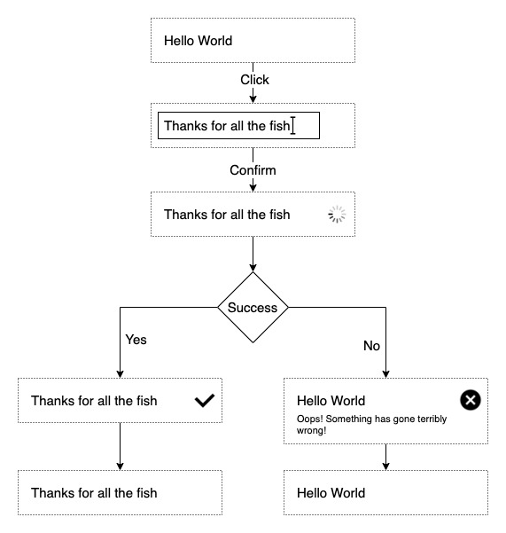

This project was bootstrapped with [Create React App](https://github.com/facebook/create-react-app).

## Descriptions
Create component to edit values inline. This component should appear as a normal text on the page, editable when clicked and displaying result of the action triggered by edit.

**NOTE:**
For the purpose of this test, feel free to use any kind of mock for the submission action. Simple promise would do!

### Wireframe

## Requirements
* Static text displays current value
* Clicking on static text will make it editable
* Clicking out of the field or pressing Enter will confirm the change
* Status indicator will display beside the text to notify user
    * Loading - change has been submitted
    * Success - change accepted
    * Error - change refused
* On error a message will display under the text    